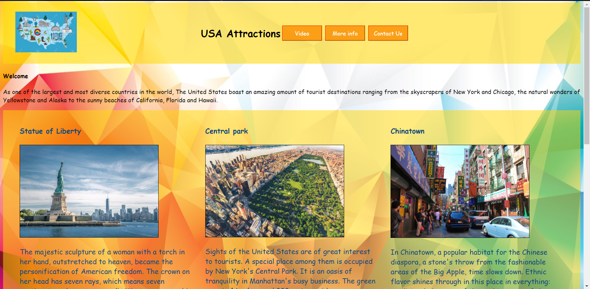
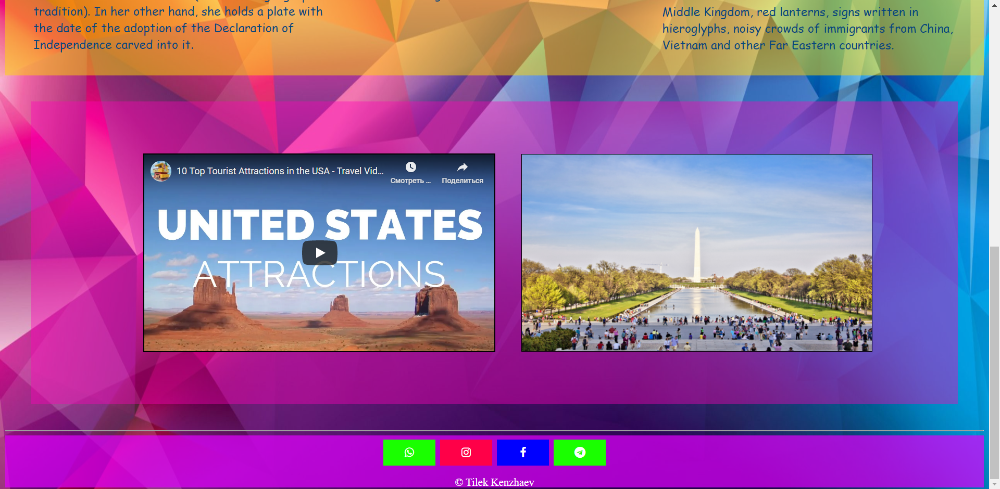

https://dsrvptxr.github.io/USA_Attractions/usa.html

Usa Attractions

As one of the largest and most diverse countries in the world, The United States boast an amazing amount of tourist destinations ranging from the skyscrapers of New York and Chicago, the natural wonders of Yellowstone and Alaska to the sunny beaches of California, Florida and Hawaii.

